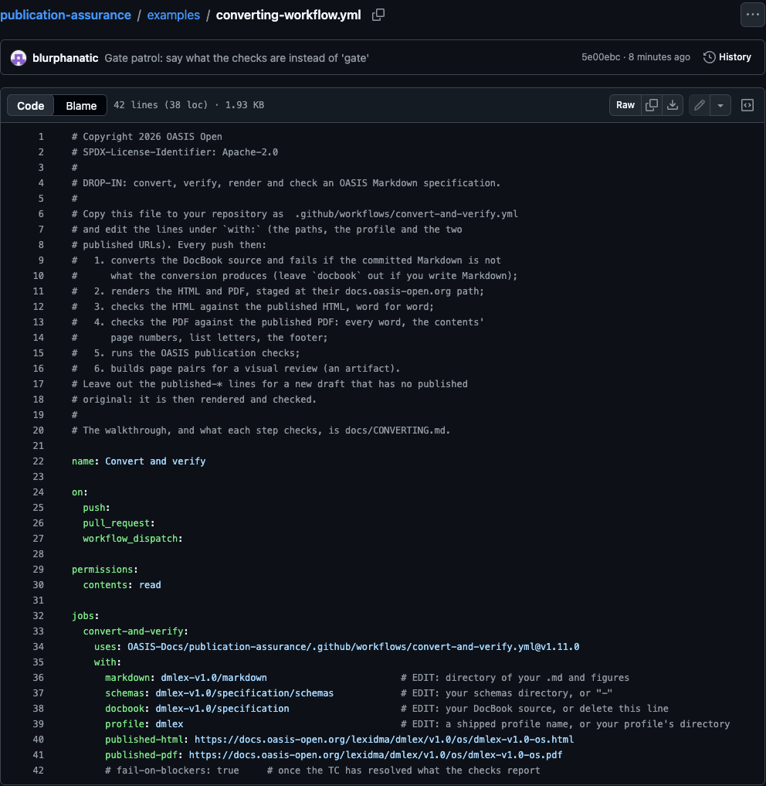
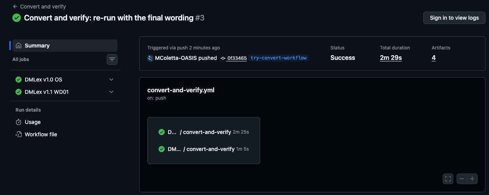
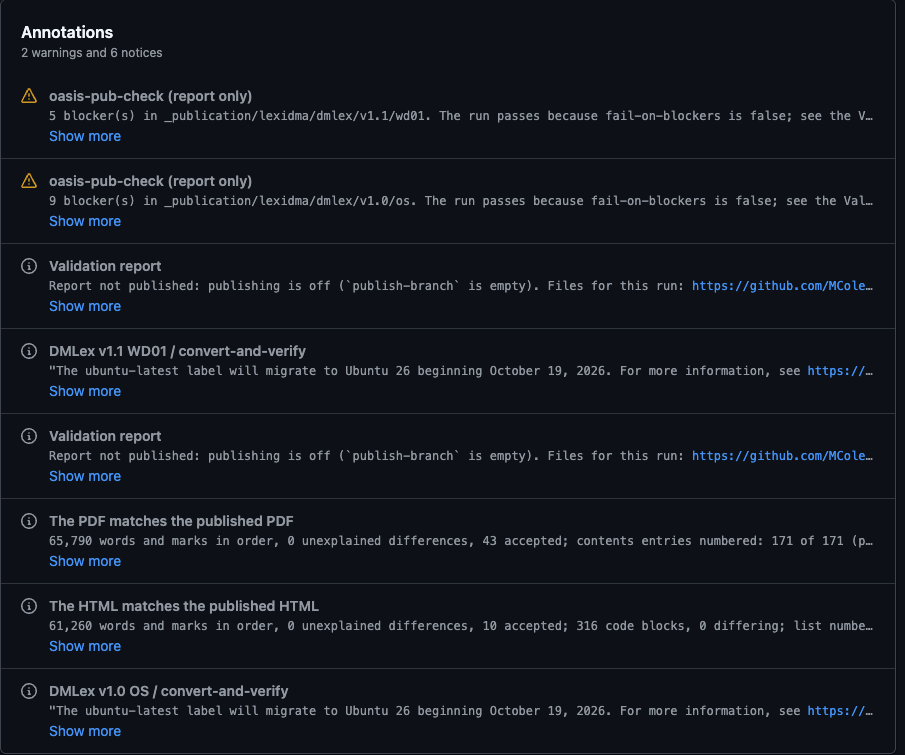
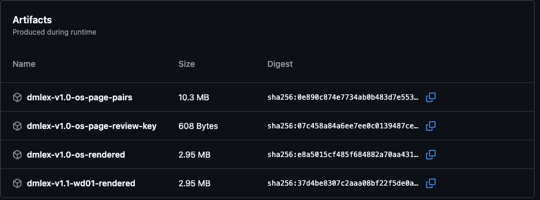
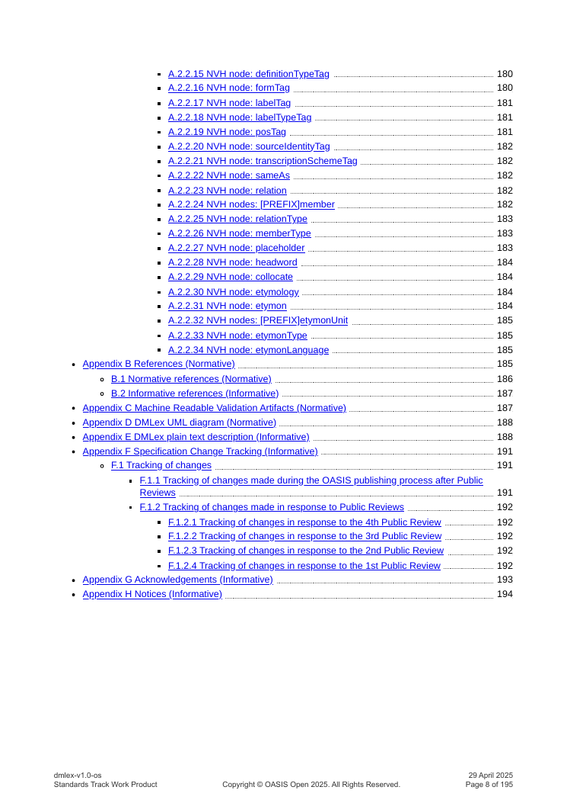
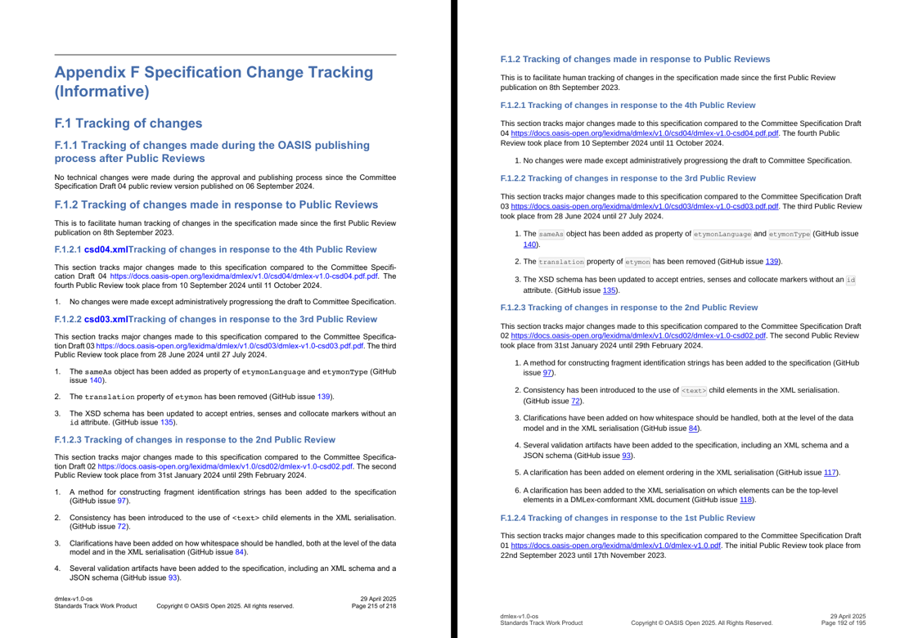

<!--
Copyright (c) OASIS Open 2026. All Rights Reserved.

This document may be copied, published, and distributed to others without
restriction, provided it is reproduced verbatim and this notice is retained.
Author: Michael Coletta, Technical Advisor to OASIS Open.
-->

# Convert and verify in one GitHub workflow

This guide is for a TC moving a published specification from DocBook to
Markdown, or writing a new version in Markdown. One file in the TC's GitHub
repository converts the source, renders the HTML and PDF, checks both
against the published originals word for word, runs the OASIS publication
checks, and prepares pages for a visual review, on every push. DMLex
(LEXIDMA TC) was the first specification set up this way; every screenshot
below is from its run.

For a Markdown edition produced alongside a DocBook source that stays the
authoritative one, the shorter `docbook-markdown` action is described in
[MARKDOWN-EDITION.md](MARKDOWN-EDITION.md).

## Setup

One file in the TC's repository runs every step below on each push. No
software is installed on anyone's machine.

**1. Copy the workflow file.** Open
[examples/converting-workflow.yml](../examples/converting-workflow.yml),
copy it with the copy button, and in the TC's repository choose **Add file >
Create new file**, name it `.github/workflows/convert-and-verify.yml`, paste,
and edit the lines under `with:`:

| Line | Set it to |
|---|---|
| `markdown` | the folder holding the specification's `.md` and its figures |
| `schemas` | the schemas folder, or `"-"` if there is none |
| `docbook` | the DocBook source folder; delete the line if the TC writes Markdown |
| `profile` | a profile shipped with the tools (`dmlex`), or the TC's own profile folder |
| `published-html`, `published-pdf` | the published specification's URLs; delete both for a new draft |

Commit the file. That commit is the first run.

**2. Watch the run.** The repository's **Actions** tab lists each run. A run
shows one job per specification. A red cross means the Markdown or the PDF
differs from the published original, or a step could not run. Blockers
found by the OASIS publication checks show as warnings and leave the run
green until `fail-on-blockers` is turned on (step 5):

**3. Read the results.** The run's page states each verdict in one line,
without opening a log. "The HTML matches the published HTML" and "The PDF
matches the published PDF" give the counts behind them. The OASIS
publication checks report their blockers, here the nine in the published
DMLex source that are for the TC to decide:

A difference from the published original fails the run. Its log prints
every difference with the words around it; to read it, sign in, open the
job, then open the step.

**4. Download what was produced.** At the foot of the run's page:

| Download | Holds |
|---|---|
| `<name>-rendered` | the HTML and PDF at their `docs.oasis-open.org` path, with the full reports of every check |
| `<name>-page-pairs` | each sampled page next to its published counterpart, and `PROMPT.md`, the brief for a reviewer |
| `<name>-page-review-key` | which pair holds the planted fault; keep it from the reviewer; grade the review with it as [render/README.md](../render/README.md#review_pairspy) describes |

The rendered PDF carries the OASIS footer and numbers its contents:

and a page pair puts the published page (left) beside the rendered one
(right). This one shows a fault in the published original: the headings
F.1.2.1 and F.1.2.2 each carry a leaked file name, `csd04.xml` and
`csd03.xml`.

**5. Keep it running.** Every later push to the specification runs the same
steps. Once the TC has settled what the OASIS publication checks report,
uncomment `fail-on-blockers: true` so a new blocker fails the run.

## Reference

- What each verifier checks, and how to read a difference:
  [verify/README.md](../verify/README.md).
- Rendering, and the page pairs for a review with their grading:
  [render/README.md](../render/README.md).
- The converter and its profiles:
  [converters/docbook-to-markdown/README.md](../converters/docbook-to-markdown/README.md).
- Cutting the next stage (for example v1.1 WD01) from the Markdown:
  [pub-check/README.md](../pub-check/README.md#cutting-the-next-stage).
