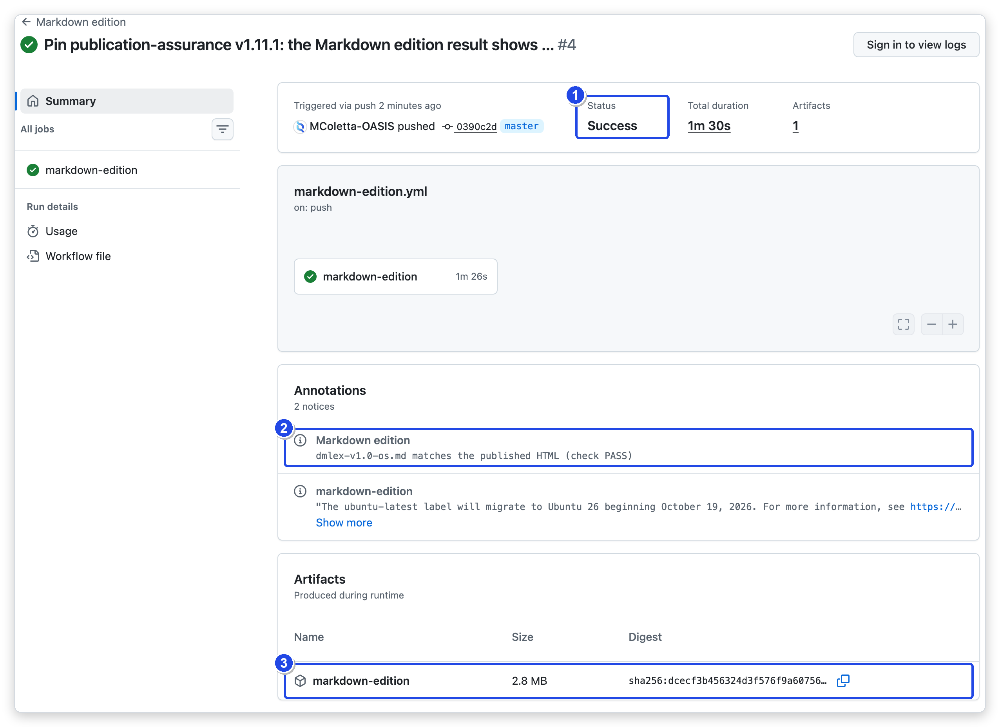
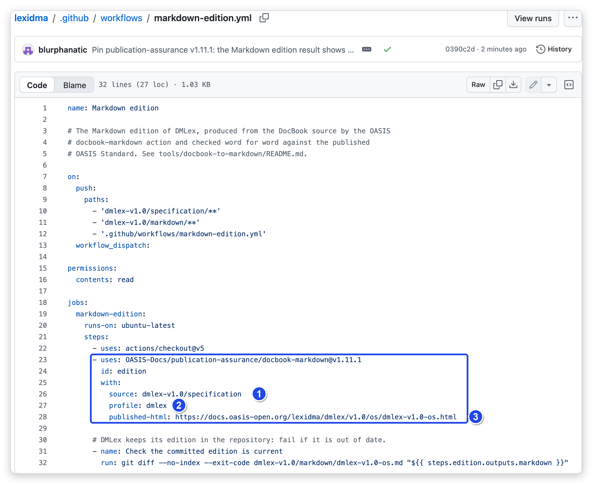
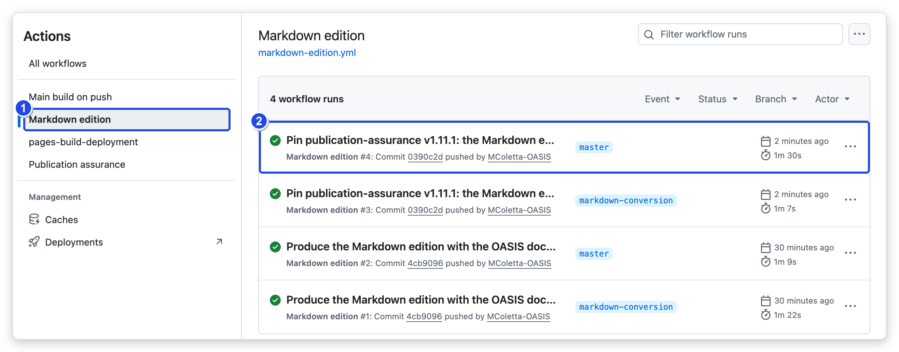
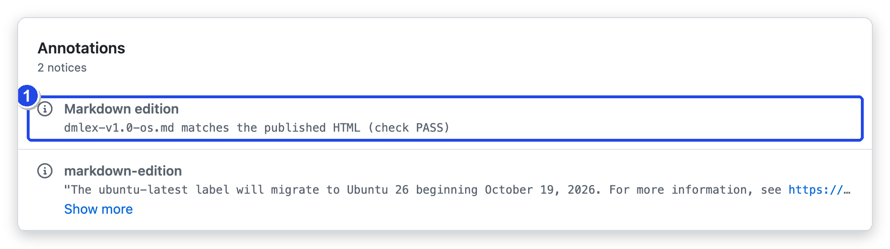
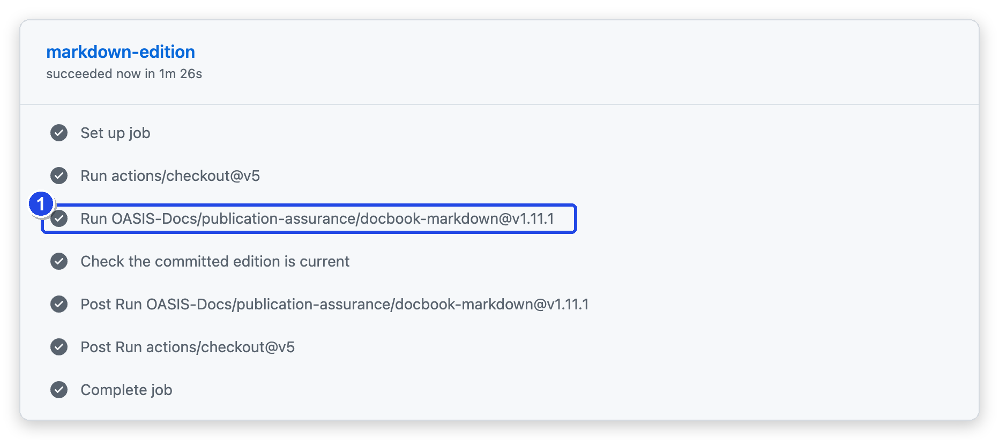
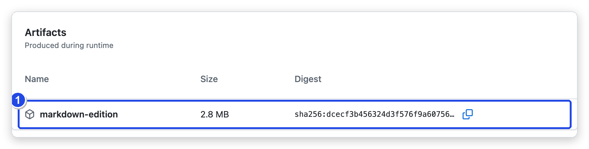

<!--
Copyright (c) OASIS Open 2026. All Rights Reserved.

This document may be copied, published, and distributed to others without
restriction, provided it is reproduced verbatim and this notice is retained.
Author: Michael Coletta, Technical Advisor to OASIS Open.
-->

# A Markdown Edition of Your DocBook Specification

Your DocBook source already produces HTML and PDF. The `docbook-markdown`
action adds one more output from the same source: the specification in the
OASIS Markdown format, with its figures, checked word for word against your
published HTML. Your DocBook source is unchanged and stays the source.

It takes one workflow file and about five minutes. The pictures below are
from the DMLex specification (LEXIDMA TC), which uses this action.



| | On the run page | Meaning |
|---|---|---|
| **1** | Status | **Success**: the edition was produced and matches |
| **2** | Annotation | The file name and the result of the check against the published HTML |
| **3** | Artifact | The Markdown edition, with HTML and PDF, to download |

## 1. Add the workflow

In your TC repository, create `.github/workflows/markdown-edition.yml` with
this content, and change the three values marked **1**, **2** and **3**:

```yaml
name: Markdown edition

on:
  push:
    paths:
      - 'dmlex-v1.0/specification/**'       # your DocBook source, so a change to it runs the workflow
  workflow_dispatch:

permissions:
  contents: read

jobs:
  markdown-edition:
    runs-on: ubuntu-latest
    steps:
      - uses: actions/checkout@v5
      - uses: OASIS-Docs/publication-assurance/docbook-markdown@v1.13.1
        with:
          source: dmlex-v1.0/specification       # 1
          profile: dmlex                         # 2
          published-html: https://docs.oasis-open.org/lexidma/dmlex/v1.0/os/dmlex-v1.0-os.html   # 3
```

| | Setting | What to put |
|---|---|---|
| **1** | `source` | The folder that holds your specification's DocBook files |
| **2** | `profile` | Your specification's profile (see [Profiles](#profiles)) |
| **3** | `published-html` | The published HTML of the same stage. The edition is checked against it. Leave the line out to skip the check |

The same file is in
[examples/docbook-markdown-workflow.yml](../examples/docbook-markdown-workflow.yml).



DMLex's file has one extra step at the end, because DMLex also keeps its
edition in the repository and wants to know when it is out of date. You do
not need it.

## 2. Run it

Commit the file. The workflow runs whenever your DocBook source changes. To
run it at any other time, open the **Actions** tab, select **Markdown
edition** (1), then **Run workflow**. Each run is listed with its result (2).



## 3. Read the result

Open a run. The annotation (1) names the file and gives the result of the
check against the published HTML:



| Result | Meaning | What to do |
|---|---|---|
| **matches** (check PASS) | Every word, code block, heading, link and figure is the same as the published HTML | Nothing |
| **differs** (check FAIL) | The run is red. Its log lists each difference with the text around it | Send the run link to OASIS TC Administration. An expected difference, such as a label the Markdown template writes differently, is recorded in the profile with its reason |
| **produced, not checked** | No `published-html` was given | Add it to have the edition checked |

The job's steps show what ran. The OASIS action is one step (1):



## 4. Download the edition

At the bottom of the run page, under **Artifacts**, download
**markdown-edition** (1). It holds:

| Folder | Contents |
|---|---|
| `markdown/` | `<name>.md` and the figures it uses |
| `package/` | The HTML and PDF rendered from the Markdown, in the folder layout of `docs.oasis-open.org` |



## Profiles

A profile tells the action where your specification's main file and version
details are. Shipped profiles:

| Profile | Specification |
|---|---|
| `dmlex` | Data Model for Lexicography (LEXIDMA TC) |

For another specification, ask OASIS TC Administration to add its profile.
You can also keep one in your repository and give its folder as `profile:`.
A profile is a `profile.json` of a few lines, described in the
[converter reference](../converters/docbook-to-markdown/README.md#profiles).

## Options

| Setting | Default | Meaning |
|---|---|---|
| `render` | `true` | Also produce HTML and PDF from the Markdown. `false` produces the Markdown only |
| `schemas` | none | A schemas folder to place beside the rendered HTML and PDF |
| `output` | `markdown-edition` | Where the results are written during the run |
| `artifact-name` | `markdown-edition` | The artifact's name. Empty for no upload |

Later steps can use the action's outputs: `markdown` (the file's path),
`verification` (`PASS`, `FAIL` or `skipped`) and `package` (the rendered
folder). To check the rendered package against the OASIS publication
criteria too, add the OASIS publication checks after it, as the
[adoption guide](ADOPTING.md) shows.

## Further reading

- [Converter reference](../converters/docbook-to-markdown/README.md): what
  the conversion does, profiles in full, and notes for maintainers.
- [Verifier reference](../verify/README.md): the check against the published
  HTML, and the matching check for the PDF.
- [Renderer reference](../render/README.md): the HTML and PDF output, and
  side-by-side page review.
